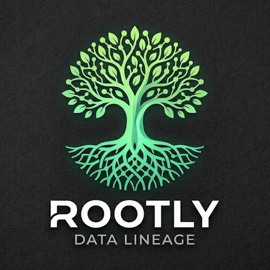

# Rootly — RAG Lineage Assistant



Sistema de linaje de datos con RAG + Claude. Los jobs de Spark (Shopflow) emiten
eventos OpenLineage a `openlineage/events.ndjson`, que el módulo RAG indexa en
ChromaDB para responder preguntas en lenguaje natural.

```
examples/job_shopflow_*.py
        │
        ▼  OpenLineageSparkListener
openlineage/events.ndjson
        │
        ▼  rag/ingest.py
NetworkX DiGraph (datasets + jobs)
        │
        ▼  rag/vectorize.py
ChromaDB (rag/.chroma/)
        │
        ▼  rag/query.py + Claude Sonnet
"¿Qué rompe si cambio orders_clean?" → respuesta
```

---

## Requisitos

| Herramienta | Versión mínima | Para qué |
|-------------|----------------|----------|
| Docker + Docker Compose | Cualquier versión reciente | Stack completo |
| Python | 3.11+ | Ejecución local |
| Java | 11 o 17 | Spark local |

---

## Variables de entorno

```bash
cp .env.example .env
```

Edita `.env` y añade como mínimo:

```
ANTHROPIC_API_KEY=sk-ant-...
```

Para modo S3 / producción, añade también las credenciales de AWS.

---

## Opción A — Docker (recomendado)

```bash
# 1. Arrancar el stack
docker compose up -d --build

# 2. Ejecutar los jobs de Shopflow (generan events.ndjson)
docker compose run --rm spark python examples/job_shopflow_orders_clean.py
docker compose run --rm spark python examples/job_shopflow_customers_enrich.py
docker compose run --rm spark python examples/job_shopflow_products_normalize.py
# ... resto de jobs en el orden del README de examples/

# 3. Abrir la UI
open http://localhost:8080   # RAG UI (chat, impacto, grafo, tareas)
```

---

## Opción B — Ejecución local (sin Docker)

Requiere Python 3.11+ y Java 11/17.

```bash
pip install -r requirements.txt

cd examples/
python job_shopflow_orders_clean.py
python job_shopflow_customers_enrich.py
# ... resto de jobs
```

Los eventos se escriben en `openlineage/events.ndjson`.

---

## Opción C — Solo el módulo RAG (sin Spark)

Si ya tienes eventos en `openlineage/events.ndjson` o en S3:

```bash
pip install -r rag/requirements.txt

# Indexar e interrogar (modo local)
python -m rag.query sync
python -m rag.query ask "¿Qué pipelines dependen de orders_clean?"
python -m rag.query chat   # modo interactivo con historial

# Análisis de impacto sin LLM
python -m rag.query impact orders_clean

# Near real-time (re-indexa cuando detecta cambios)
python -m rag.query watch
```

Consulta [rag/README.md](rag/README.md) para documentación completa del módulo.

---

## Servicios y puertos

| Servicio | URL | Descripción |
|----------|-----|-------------|
| RAG UI | http://localhost:8080 | Chat, impacto, grafo, tareas |
| RAG API | http://localhost:8000 | REST API (ver [backend/README.md](backend/README.md)) |
| Redis | localhost:6379 | Broker de Celery (interno) |

---

## Estructura del proyecto

```
.
├── Dockerfile                  # Imagen Spark con OpenLineage pre-instalado
├── docker-compose.yml          # Stack completo (Redis + RAG + Spark)
├── requirements.txt            # PySpark, jsonlines
├── .env.example                # Plantilla de variables de entorno
├── examples/                   # Jobs PySpark de Shopflow (ver examples/README.md)
├── rag/                        # Módulo RAG (ver rag/README.md)
├── backend/                    # FastAPI + Celery (ver backend/README.md)
├── frontend/                   # React + Vite UI
├── openlineage/                # events.ndjson generado por los jobs (git-ignored)
├── knowledge/                  # Documentos de negocio indexables (.md, .xlsx)
└── chat/                       # Historial de conversaciones (git-ignored)
```

---

## Versiones de componentes

| Componente | Versión |
|------------|---------|
| PySpark | 3.5.x |
| OpenLineage Spark | 1.43.0 |
| ChromaDB | ≥ 0.5.0 |
| Anthropic SDK | ≥ 0.40.0 |
| Python | 3.11+ |
| Java | 11 o 17 |
| Node.js | 20+ |

---

## GitHub Actions

El workflow `.github/workflows/lineage-impact.yml` analiza automáticamente el
impacto de los PRs que modifican jobs Glue (`glue/code/jobs/**/*.py`) y publica
un comentario con los datasets afectados downstream.

Requiere el secret `LINEAGE_API_URL` apuntando a tu RAG API desplegada.
